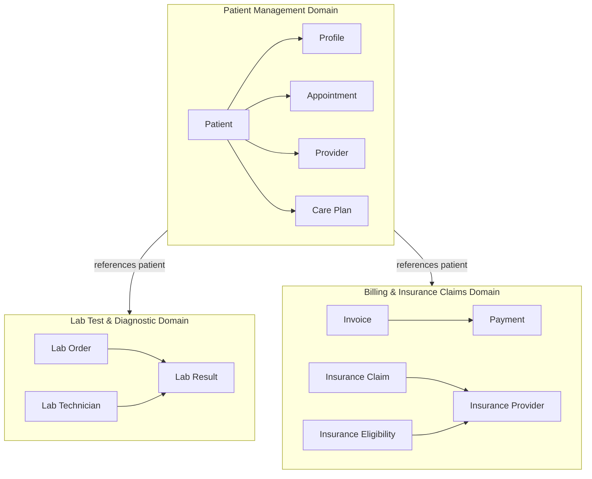

# My Project

## System Diagram

```mermaid
graph TB

    subgraph PM["Patient Management Domain"]
        Patient[Patient]
        Profile[Profile]
        Appointment[Appointment]
        Provider[Provider]
        CarePlan[Care Plan]

        Patient --> Profile
        Patient --> Appointment
        Patient --> Provider
        Patient --> CarePlan
    end

    subgraph BIC["Billing & Insurance Claims Domain"]
        Invoice[Invoice]
        Payment[Payment]
        InsuranceClaim[Insurance Claim]
        InsuranceProvider[Insurance Provider]
        InsuranceEligibility[Insurance Eligibility]

        Invoice --> Payment
        InsuranceClaim --> InsuranceProvider
        InsuranceEligibility --> InsuranceProvider
    end

    subgraph LTD["Lab Test & Diagnostic Domain"]
        LabOrder[Lab Order]
        LabResult[Lab Result]
        LabTechnician[Lab Technician]

        LabOrder --> LabResult
        LabTechnician --> LabResult
    end

    PM -->|references patient| LTD
    PM -->|references patient| BIC
```
